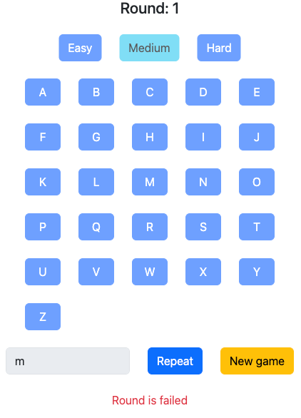

### A variant of the classical [Simon Says](https://en.wikipedia.org/wiki/Simon_says) game, where players must remember and reproduce sequences of keyboard symbols.

- The game consists of **5 rounds** and **3 levels of difficulty**. In each round, the user must repeat **a sequence of keyboard symbols** based on the level of difficulty.
- The levels of difficulty are:
  - **Easy**: only numbers (0-9);
  - **Medium**: only letters (A-Z);
  - **Hard**: letters (A-Z) and numbers (0-9).
- The same symbol can be used **multiple times** in a sequence.
- For the letters, both upper and lower case letters **are allowed** and are treated as **the same symbol** _(e.g. if the sequence has the letter "a", it is also possible to type "A")_.
- The first round starts with **2 symbols** based on the level of difficulty.
- Each new round presents a new **randomly generated** sequence based on the level of difficulty, with the sequence length **increasing by two symbols** each round (culminating in a 10-symbol sequence by the 5th round).
- The user can use both **virtual** _(by clicking keys on the screen)_ and **physical** keyboards _(by pressing keys on their keyboard)_ to play the game.
- Handling NumPad events **is not required**. NumPad inputs can be ignored during the game.
- Pressing keys with symbols that are not part of the current difficulty level **must be ignored** during the game _(e.g. for the "Medium" level, pressing any not letter key must be ignored)_.
- **Only one key** can be processed at a time. If the user attempts to press multiple keys simultaneously, the application should process only the first key press detected to prevent multiple inputs from being registered at the same moment.
